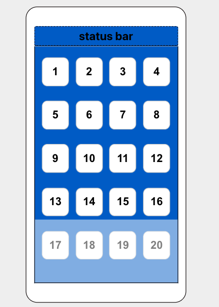

# Layout

Requirements:

- [ ] Create the layout similar as the phone screen
- [ ] Every button is clickable to see the effect

//Finished and please see image.png for the result and PhoneLayout.js for the code
